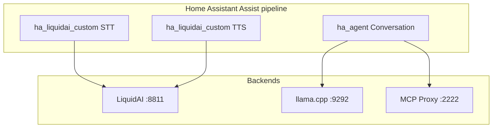

# HA Agent — Assist conversation integration

Project root: `~/Projects/ha_agent`  
Speech (STT/TTS): [`~/Projects/ha_liquidai`](../ha_liquidai)  
Legacy stack: `~/Projects/ha_liquidai_n8n` (n8n + Webhook Conversation — **retired**; see [docs/migration-from-n8n.md](docs/migration-from-n8n.md))

## Goal

Native Home Assistant integration for the **Assist conversation agent**:

1. **LLM** — OpenAI-compatible chat with tool calling (`:9292/v1`)
2. **MCP Proxy** — tools for Home Assistant, news, mail (`:2222/mcp`)
3. **Agent loop** — `run_agent()` replaces n8n `/webhook/agent`

STT and TTS live in the separate **[ha_liquidai](https://github.com/holger81/ha_liquidai)** integration.

## Target architecture



## Repository layout

```
ha_agent/
├── custom_components/ha_agent/
│   ├── agent.py           # tool loop, memory, streaming
│   ├── conversation.py    # AbstractConversationAgent
│   ├── llm_client.py      # OpenAI-compatible chat + streaming
│   ├── mcp_client.py      # MCP Proxy JSON-RPC / callTool
│   ├── context.py         # exposed entities, tool hints
│   ├── tools.py           # mcp_call_tool schema + execute
│   ├── memory.py          # per-conversation_id history
│   ├── config_flow.py     # prompts → LLM → MCP → agent settings
│   └── ...
├── tests/
├── scripts/
└── docs/
```

## UI configuration

Every backend URL, model ID, credential, and agent setting is editable in Home Assistant — no hardcoded hosts in runtime code. `const.py` supplies **defaults for form fields only**.

### Config flow steps

| Step | Fields | Validates |
|------|--------|-----------|
| **1. Agent prompts** | System prompt, tool instructions (multiline) | — |
| **2. LLM** | Base URL, model ID, API key (optional), max tokens, temperature, timeout, enable thinking | Chat/models probe |
| **3. MCP** | Proxy URL, bearer token, timeout, health URL | Health GET + MCP initialize |
| **4. Agent settings** | Max iterations, history turns, enable streaming | — |

Phase 5 adds **router options** (still UI-only):

| Options (Phase 5) | Fields |
|-------------------|--------|
| Action backend | Use separate action model (bool); if true: action URL, model ID, temperature |

---

## Phases

> Phases 0–3 (LiquidAI STT/TTS) are tracked in [ha_liquidai PLAN.md](https://github.com/holger81/ha_liquidai/blob/main/PLAN.md).

### Phase 4 — Conversation agent + agentic loop (3–5 days)

**Scope:** Replace n8n `/webhook/agent` + Webhook Conversation with native conversation platform.

#### Status

- [x] `llm_client.py` — OpenAI-compatible chat, tools, streaming
- [x] `context.py` — exposed entities, system message builder
- [x] `tools.py` — `mcp_call_tool` wrapper
- [x] `agent.py` — `run_agent()` while-loop with memory
- [x] `conversation.py` — `AbstractConversationAgent`
- [x] `config_flow.py` — prompts → LLM → MCP → agent settings
- [x] Unit tests for agent, context, llm_client, memory, Phase 4 scenarios
- [x] `scripts/smoke_test_phase4.py` — LLM + MCP backend smoke test
- [x] Live streaming to Assist (`async_add_delta_content_stream`)

#### Exit criteria (automated)

- [x] Light on/off with exposed entity — 1 MCP or native call (`test_phase4_scenarios.py`)
- [x] Cover open without exposed entity — search + open_cover (`test_phase4_scenarios.py`)
- [x] “What's the news?” — model selects MCP news tools in agent loop (`test_phase4_scenarios.py`)
- [x] Email unread count via MCP mail tools (`test_phase4_scenarios.py`)
- [x] Conversation memory across turns (same `conversation_id`) (`test_phase4_scenarios.py`)
- [x] Streaming deltas forwarded to Assist (`test_agent.py`)

#### Exit criteria (production validation)

- [x] Streaming text + TTS in Assist (voice pipeline)
- [x] Deployed in HA; pipeline uses `conversation.ha_agent`
- [x] `scripts/smoke_test_phase4.py` passes against your LLM + MCP hosts

**Design notes:** No special news route or MCP-only bypass — the LLM decides when to call tools inside `run_agent()`.

---

### Phase 5 — Multi-model router + MCP polish (2–3 days)

**Scope:** Optional routing to different LLM backends for latency/reliability. **Not** topic-specific bypasses.

#### Status

- [x] `router.py` — `TaskRoute.HA_ACTION` vs `TaskRoute.CHAT`
- [x] Action model config step + device **Configuration** selects (chat + action)
- [x] Options flow — chat and action model dropdowns
- [x] Diagnostic sensors (last route, MCP tools, LLM/MCP reachability)
- [x] MCP friendly auth/timeout errors
- [x] `scripts/smoke_test_mcp.py`
- [x] Tests — `test_router.py`, `test_mcp_errors.py`

#### Exit criteria

- [x] Optional action route uses action backend for device commands (unit test)
- [x] MCP bearer auth failure shows friendly error message
- [x] `scripts/smoke_test_mcp.py` calls MCP tools (default `news_curate`)

---

### Phase 6 — Full migration + HACS polish (1–2 days)

**Tasks**

1. **Assist pipeline wiring**
   - STT → [ha_liquidai](https://github.com/holger81/ha_liquidai) STT
   - Conversation → **ha_agent**
   - TTS → [ha_liquidai](https://github.com/holger81/ha_liquidai) TTS

2. **Remove from HA**
   - Webhook Conversation integration (or leave installed but unwired)
   - n8n webhook URLs from pipeline

3. **Retire n8n workflow** (`ha_liquidai_n8n`)
   - Archive workflow JSON
   - Update README: “legacy reference only”

4. **Docs**
   - `docs/migration-from-n8n.md` — step-by-step
   - Cross-link [LiquidAI assist-setup](https://github.com/holger81/ha_liquidai/blob/main/docs/assist-setup.md)

5. **HACS**
   - Display name **HA Agent**
   - `hassfest` + ruff CI on full component
   - GitHub release tags

#### Exit criteria

- [ ] End-to-end voice: mic → STT → agent (tools) → streaming TTS → speaker
- [ ] No n8n container required for daily Assist use
- [ ] HACS install documented

---

## Code port map (n8n → Python)

| n8n | Python |
|-----|--------|
| LangChain Agent node | `run_agent()` while-loop |
| MCP Client Tool sub-node | `McpProxyClient.call_tool()` |
| Memory Buffer Window | `memory.py` keyed by `conversation_id` |
| LLM Chat OpenAI sub-node | `llm_client.chat_completion()` |
| Agent input Code node | `context.build_system_message()` |
| Streaming webhook | `conversation.py` native streaming |

---

## Testing checklist

### Phase 4 (Agent)

- [x] Light on/off with exposed entity (unit test)
- [x] Cover open without exposed entity (unit test)
- [x] “What's the news?” / follow-up — model selects MCP news tools (unit test)
- [x] Email unread count (unit test)
- [x] Streaming deltas to Assist (unit test)
- [x] Conversation memory across turns (unit test)
- [x] Voice pipeline validation in production

### Phase 5 (Router + MCP)

- [ ] Action route (if enabled) uses action model for device commands only
- [ ] MCP bearer auth failure shows friendly error
- [ ] Malformed tool args caught before MCP call

### End-to-end (Phase 6)

- [x] Full voice pipeline without n8n (native STT + HA Agent + native TTS)
- [x] Pointing LLM/MCP at alternate hosts via UI only (no code change)
- [x] Migration guide and legacy n8n reference docs

---

## Next action

**Phase 6 complete.** Stack is native: **ha_liquidai** (STT/TTS) + **ha_agent** (conversation). Use [docs/migration-from-n8n.md](docs/migration-from-n8n.md) to decommission n8n.
