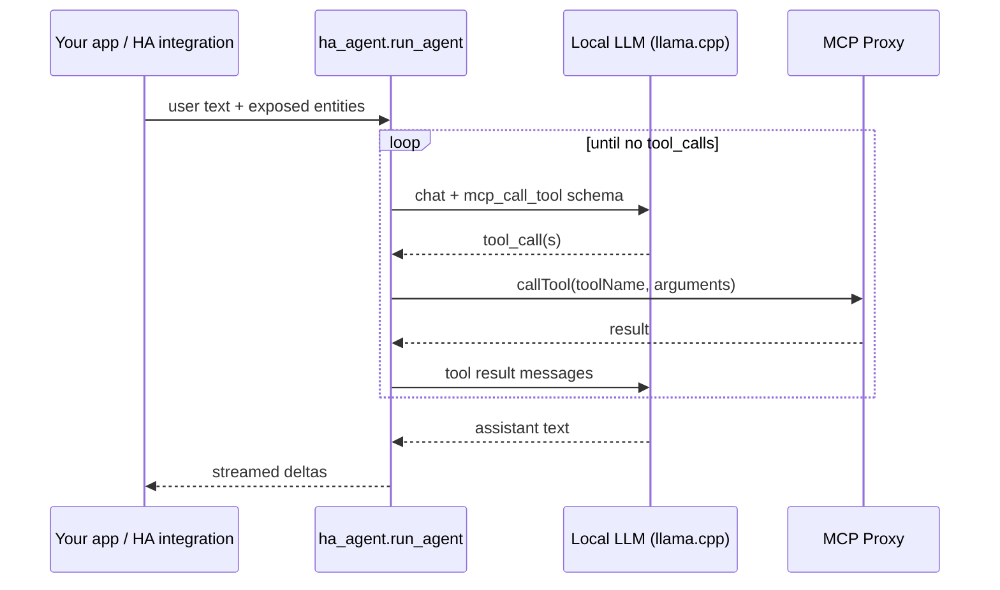

# ha_agent

Python library for a **Home Assistant-compatible agentic loop** that calls **local LLM** backends (OpenAI-compatible, e.g. llama.cpp) and **MCP Proxy** tools.

Designed to power Assist conversation agents without n8n or LangChain — a single asyncio loop where the model chooses MCP and HA tools via `mcp_call_tool`.

## Features

- OpenAI-compatible `/v1/chat/completions` client with tool calling and SSE streaming
- MCP Proxy JSON-RPC client (`callTool` with flat `toolName` + `arguments`)
- Agent loop with configurable max iterations and conversation memory
- Context builder for exposed entities, news, and device-action hints
- No Home Assistant runtime dependency — embed in custom integrations or run standalone

## Install

```bash
pip install git+https://github.com/holger81/ha_agent.git
```

For development:

```bash
python3 -m venv .venv
source .venv/bin/activate
pip install -r requirements.txt
```

## Quick start

```python
import asyncio

import aiohttp

from ha_agent import (
    AgentConfig,
    ConversationMemory,
    LlmBackend,
    LlmClient,
    McpConfig,
    McpProxyClient,
    run_agent,
)


async def main() -> None:
    async with aiohttp.ClientSession() as session:
        llm = LlmClient(session)
        mcp = McpProxyClient(
            session,
            McpConfig(
                url="http://127.0.0.1:2222/mcp",
                bearer_token="your-token",
            ),
        )
        backend = LlmBackend(
            base_url="http://127.0.0.1:8080/v1",
            model="local-model",
        )
        config = AgentConfig(enable_streaming=False)
        memory = ConversationMemory()

        async for chunk in run_agent(
            llm=llm,
            mcp_client=mcp,
            backend=backend,
            agent_config=config,
            user_text="Turn off the dining room lights",
            exposed_entities=[
                {"entity_id": "light.dining", "name": "Dining", "state": "on"},
            ],
            conversation_id="demo",
            memory=memory,
        ):
            print(chunk, end="")


asyncio.run(main())
```

## Architecture



## Home Assistant integration

Use this library from a custom integration's `AbstractConversationAgent` implementation. See [ha_liquidai](https://github.com/holger81/ha_liquidai) for a full Assist pipeline (STT, agent, TTS).

Typical wiring:

1. Create `LlmClient` and `McpProxyClient` from config entry data
2. Map HA exposed entities into `exposed_entities`
3. Stream `run_agent()` deltas into the conversation response
4. Store `ConversationMemory` in `hass.data` or wrap it for HA lifecycle

## Configuration

| Setting | Default | Description |
|---------|---------|-------------|
| `LlmBackend.base_url` | `http://127.0.0.1:8080/v1` | OpenAI-compatible API base |
| `LlmBackend.model` | `local-model` | Model ID |
| `McpConfig.url` | `http://127.0.0.1:2222/mcp` | MCP Proxy endpoint |
| `AgentConfig.max_iterations` | `8` | Tool loop limit |
| `AgentConfig.history_turns` | `10` | Conversation memory turns |

## Development

```bash
python3 -m ruff check .
python3 -m pytest tests/
```

## License

MIT
