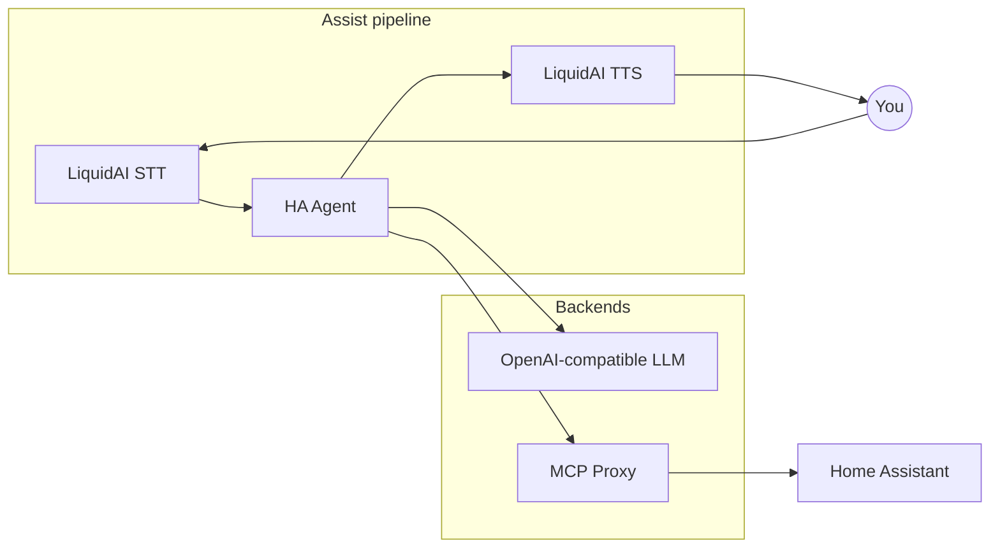

# HA Agent

**HA Agent** is a Home Assistant custom integration that powers the **Assist conversation** stage of your voice pipeline. It connects your assistant to a local LLM and an MCP tool server so Assist can answer questions, control devices, fetch news, check email, and more — with multi-turn memory and optional learned skills.

Replaces the n8n **Webhook Conversation** agent from [ha_liquidai_n8n](https://github.com/holger81/ha_liquidai_n8n). See **[Migration from n8n](docs/migration-from-n8n.md)** if you are switching from the hybrid workflow.
Pair it with **[LiquidAI](https://github.com/holger81/ha_liquidai)** for speech-to-text and text-to-speech in the same pipeline.

> **Migrating from n8n?** Follow **[docs/migration-from-n8n.md](docs/migration-from-n8n.md)** for a step-by-step cutover from Webhook Conversation to HA Agent.



---

## What it does

- **Conversation agent** — registers as your Assist conversation provider
- **Tool loop** — calls MCP tools (lights, covers, news, mail, …) until the task is done
- **Multi-turn memory** — follow-ups like “turn them back off” reuse prior context
- **Streaming** — text deltas flow to LiquidAI TTS for responsive voice replies
- **Learned skills** — optional workflows saved after successful multi-step tasks and reused later
- **Live tuning** — change chat/action models and skill settings from the HA Agent device page

---

## Requirements

| Item | Notes |
|------|--------|
| Home Assistant | **2025.10+** (conversation streaming) |
| LLM server | OpenAI-compatible API (e.g. [llama.cpp](https://github.com/ggerganov/llama.cpp)) |
| MCP Proxy | Tool server with bearer token (Home Assistant, news, email, …) |
| Speech (optional) | [ha_liquidai](https://github.com/holger81/ha_liquidai) for STT/TTS |

---

## Install with HACS

The easiest way to install is through [HACS](https://hacs.xyz/).

### 1. Add the custom repository

1. Open **HACS** → **Integrations**
2. Click the **⋮** menu (top right) → **Custom repositories**
3. Paste the repository URL:

   ```
   https://github.com/holger81/ha_agent
   ```

4. Category: **Integration** → **Add**

### 2. Download the integration

1. In HACS → **Integrations**, search for **HA Agent**
2. Open it → **Download**
3. **Restart Home Assistant**

### 3. Add the integration

1. **Settings** → **Devices & services** → **Add integration**
2. Search for **HA Agent** and complete the setup wizard (see [First-time setup](#first-time-setup) below)

> **Tip:** Install **[LiquidAI](https://github.com/holger81/ha_liquidai)** the same way if you want voice input and output.

---

## Manual install

Copy the integration into your config folder and restart Home Assistant:

```bash
git clone https://github.com/holger81/ha_agent.git
HA_CONFIG=/path/to/your/homeassistant/config ./ha_agent/scripts/deploy_to_ha.sh
```

Or copy `custom_components/ha_agent/` into `<config>/custom_components/` yourself.

---

## First-time setup

After adding the integration, the config flow walks you through:

| Step | What you configure |
|------|---------------------|
| **Agent prompts** | System prompt and short MCP tool reminder |
| **LLM backend** | Base URL, model, API key (optional), temperature, timeout |
| **MCP Proxy** | URL, bearer token, health check URL |
| **Action model** *(optional)* | Smaller/faster model for device commands only |
| **Agent settings** | Max tool iterations, conversation history, streaming |

Defaults assume a local stack (e.g. llama.cpp on `:9292`, MCP Proxy on `:2222`). Change everything in the UI — nothing is hardcoded at runtime.

---

## Wire up Assist

### 1. Expose entities

**Settings** → **Voice assistants** → **Expose** — enable the lights, covers, and other entities you want the agent to control.

### 2. Set the pipeline

**Settings** → **Voice assistants** → your assistant → **Configure**:

| Stage | Provider |
|-------|----------|
| Speech-to-text | **LiquidAI STT** |
| Conversation | **HA Agent** |
| Text-to-speech | **LiquidAI TTS** |

Remove any old **Webhook Conversation** entry if you are migrating from n8n.

### 3. Talk or type

Use Assist from the dashboard, the companion app, or a voice satellite. Example prompts:

- *“Turn off the dining room lights”*
- *“What’s the news?”*
- *“How many unread emails do I have?”*
- *“Turn them back off”* *(follow-up — uses conversation memory)*

---

## Using the agent day to day

### Device page

Open **Settings** → **Devices & services** → **HA Agent** → your device.

**Configuration** (you can change these anytime):

| Entity | Purpose |
|--------|---------|
| Chat model | Main conversational model |
| Action model | Optional faster model for device actions |
| Action model routing | Send device commands to the action model |
| Skill learning | Learn workflows from successful multi-step tasks |
| Skill auto-save | Save skills without asking |
| Skill auto-use | Inject matching skills into new requests |

**Diagnostic** sensors show last route (`chat` / `action`), MCP tool count, LLM/MCP reachability, active skill, and skill stats.

### Options flow

**Configure** on the integration card → **Models and routing**, then **Skills** to set how many skills are injected per turn (default 3).

### Learned skills

When **Skill learning** is on and a multi-step task succeeds:

- **Auto-save off** — the agent asks *“Save this as a skill?”*; reply **yes** to store it
- **Auto-save on** — the skill is saved in the background

Manage skills by voice or text:

- *“List my skills”*
- *“Disable the dining room lights skill”*
- *“Enable skill …”* / *“Delete skill …”*

Automations can call `ha_agent.enable_skill`, `ha_agent.disable_skill`, `ha_agent.delete_skill`, and `ha_agent.list_skills`.

### Follow-up conversations

The agent keeps short per-conversation history (configurable turn count). Pronouns and phrases like *“them”*, *“again”*, and *“back”* can refer to entities controlled in the previous turn.

---

## Architecture (short)

```
Assist → ha_liquidai STT → HA Agent → ha_liquidai TTS → you
                              ↓
                    LLM (:9292/v1) + MCP Proxy (:2222/mcp)
```

HA Agent runs an LLM tool loop: the model may call MCP tools several times per turn until it has a final answer. Streaming mode sends text to TTS as it is generated.

---

## Verify everything works

From your dev machine (optional):

```bash
pip install aiohttp
export HA_AGENT_MCP_TOKEN="your-bearer-token"   # if required
python3 scripts/smoke_test_phase4.py
```

In Assist, try a device command, a news question, and a follow-up in the same conversation. Enable streaming in agent settings and check that replies appear progressively.

More detail: **[Assist pipeline setup](docs/assist-setup.md)** · **[Migration from n8n](docs/migration-from-n8n.md)** · **[LiquidAI STT/TTS](https://github.com/holger81/ha_liquidai/blob/main/docs/assist-setup.md)**

---

## Development

```bash
pip install -r requirements.txt
ruff check custom_components tests
pytest tests/
```

See [PLAN.md](PLAN.md) for the roadmap.

---

## License

MIT
