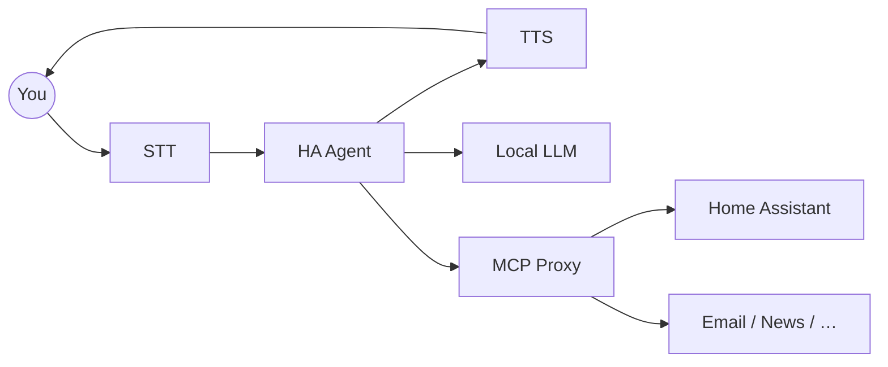

# HA Agent

**Your Home Assistant Assist agent — local LLM, real tools, lasting skills.**

HA Agent is the conversation brain in your Assist pipeline. Speak or type a request; it plans, calls tools through MCP, and answers — then remembers enough context to handle *“turn them back off”* without starting over.

Built for a home that stays private: OpenAI-compatible local models (llama.cpp and friends), your own MCP tool server, optional [LiquidAI](https://github.com/holger81/ha_liquidai) STT/TTS for a fully on-prem voice stack.


```mermaid
flowchart LR
  You((You)) --> STT[STT]
  STT --> Agent[HA Agent]
  Agent --> TTS[TTS]
  TTS --> You
  Agent --> LLM[Local LLM]
  Agent --> MCP[MCP Proxy]
  MCP --> HA[Home Assistant]
  MCP --> Mail[Email / News / …]
```

---

## Why HA Agent

| | |
|--|--|
| **Device control that sticks** | Routes device commands to an action lane (optional dedicated model) and keeps follow-ups grounded in what it actually controlled. |
| **More than lights** | Same loop drives MCP domains — mail, news, smart home, and whatever else your proxy exposes. |
| **Skills that learn** | Successful multi-step workflows can become reusable skills (with optional per-skill models). |
| **Built for Assist** | Streaming replies for voice, short conversation memory, and a sidebar console for admins. |
| **Tunable live** | Swap chat/action models, routing, and skill settings from the HA UI — no redeploy for day-to-day changes. |

**Try saying:**

- *“Turn off the dining room lights.”*
- *“What’s in the news?”*
- *“Any unread email?”*
- *“Turn them back off.”* ← follow-up; uses conversation memory

---

## Requirements

| | |
|--|--|
| Home Assistant | **2025.10+** (conversation streaming) |
| LLM | OpenAI-compatible API (e.g. [llama.cpp](https://github.com/ggerganov/llama.cpp)) |
| Tools | An MCP proxy (or compatible server) with bearer auth — Home Assistant, news, email, … |
| Voice *(optional)* | [LiquidAI](https://github.com/holger81/ha_liquidai) for STT/TTS |

---

## Install with HACS

1. **HACS** → **Integrations** → **⋮** → **Custom repositories**
2. URL: `https://github.com/holger81/ha_agent` · Category: **Integration** → **Add**
3. Search **HA Agent** → **Download** → **Restart Home Assistant**
4. **Settings** → **Devices & services** → **Add integration** → **HA Agent**

Tip: install [LiquidAI](https://github.com/holger81/ha_liquidai) the same way for voice in / voice out.

### Manual install

```bash
git clone https://github.com/holger81/ha_agent.git
HA_CONFIG=/path/to/your/homeassistant/config ./ha_agent/scripts/deploy_to_ha.sh
```

Or copy `custom_components/ha_agent/` into `<config>/custom_components/` and restart.

---

## First-time setup

The config flow covers:

| Step | What you set |
|------|----------------|
| **Prompts** | System prompt and short tool reminder |
| **Chat LLM** | Base URL, model, optional API key, temperature, timeout |
| **MCP Proxy** | URL, bearer token, health check |
| **Action model** *(optional)* | Faster/smaller model for device control |
| **Limits** | Max tool iterations, history length, streaming |

Defaults assume a local stack (e.g. llama.cpp on `:9292`, MCP on `:2222`). Everything is editable later in the UI.

---

## Wire up Assist

1. **Expose entities** — **Settings** → **Voice assistants** → **Expose** the devices the agent may control.
2. **Pipeline** — **Settings** → **Voice assistants** → your assistant → **Configure**:

   | Stage | Provider |
   |-------|----------|
   | Speech-to-text | LiquidAI STT *(or another STT)* |
   | Conversation | **HA Agent** |
   | Text-to-speech | LiquidAI TTS *(or another TTS)* |

3. Talk from the dashboard, companion app, or a voice satellite — or use the **HA Agent** sidebar console for text.

---

## Day to day

### Device page & options

**Settings** → **Devices & services** → **HA Agent** → device:

- Chat / action models and action routing
- Skill learning, auto-save, auto-use
- Diagnostics: route (`chat` / `action`), MCP reachability, active skill, tool counts

**Configure** on the integration card for model roles and how many skills inject per turn.

### Skills

With **Skill learning** on, a successful multi-step turn can become a skill:

- Auto-save **off** → agent asks *“Save this as a skill?”*
- Auto-save **on** → saved in the background

Manage by voice (*“list my skills”*, *“disable …”*) or from the console. Automations can call `ha_agent.enable_skill`, `ha_agent.disable_skill`, `ha_agent.delete_skill`, and `ha_agent.list_skills`.

Skills can optionally pin their own LLM model; otherwise they inherit chat (or legacy email/news backends when still configured).

### Console

Sidebar **HA Agent** (admin): chat, skills, settings, activity. Details: **[Agent Console](docs/agent-console.md)**.

---

## How a turn works

```
You → Assist (optional STT) → HA Agent → optional TTS → You
                                 │
                    route: action | chat
                                 │
              skill match → LLM tool loop → MCP tools
```

- **action** — device control (optional dedicated model)
- **chat** — everything else (including email/news via skills)

The model may call several MCP tools per turn. Streaming sends text to TTS as it arrives.

---

## Verify

```bash
pip install aiohttp
export HA_AGENT_MCP_TOKEN="your-bearer-token"   # if required
python3 scripts/smoke_test_phase4.py
```

In Assist: a light command, a news or mail question, then a follow-up in the same conversation. Turn streaming on and confirm progressive replies.

More: **[Assist setup](docs/assist-setup.md)** · **[Agent Console](docs/agent-console.md)** · **[LiquidAI Assist](https://github.com/holger81/ha_liquidai/blob/main/docs/assist-setup.md)**

---

## Development

```bash
pip install -r requirements.txt
ruff check custom_components tests
pytest tests/
```

Roadmap: [PLAN.md](PLAN.md).

---

## License

MIT
