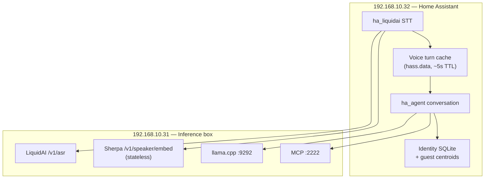

# Voice identity — Sherpa-ONNX on inference box (Phase 9b)

Captured 2026-07. Implements **unsupervised speaker tracking**: same voice → same
stable `agent_user_id` over time, **without enrolling voices first**. Optional naming
and promotion come in Phase 9c.

**Companion doc (ha_liquidai / STT bridge):**
[ha_liquidai voice-speaker-embed-plan.md](https://github.com/holger81/ha_liquidai/blob/main/docs/voice-speaker-embed-plan.md)

**Prerequisite:** [Phase 9a identity registry](agent-identity-design.md) (shipped v1.14.0).

**Status (2026-07):** Step 1 (inference API) **shipped** in liquidai-audio-docker. Steps 2–5 **pending** in ha_liquidai / ha_agent.

## Repository map (local)

| Step | Repo | Path |
|------|------|------|
| 1 — `/v1/speaker/embed` | [liquidai-audio-docker](https://github.com/holger81/liquidai-audio-docker) | `~/MeineDateien/Projekte/liquidai-audio` |
| 2 — STT bridge + cache | [ha_liquidai](https://github.com/holger81/ha_liquidai) | `~/Projects/ha_liquidai` |
| 3–5 — clustering + conversation | [ha_agent](https://github.com/holger81/ha_agent) | `~/Projects/ha_agent` |

---

## Goal

| Requirement | How |
|-------------|-----|
| No per-person training at start | Pre-trained embedding model; clustering in ha_agent |
| Same person → same ID every time | Guest centroids in SQLite; cosine match on each utterance |
| Different people → different IDs | New guest when similarity below threshold |
| Fits existing stack | Embeddings on inference box; identity logic on HA |
| Privacy | LAN-only; no cloud; optional no raw-audio retention |

**Not in scope for 9b:** VoiceBM MQTT, Wyoming Voice Match enrollment-only flows,
Phase 10 user-bound memory.

---

## Stack (current)

| Host | Role | Services |
|------|------|----------|
| `192.168.10.32` | Home Assistant | ha_liquidai STT/TTS, ha_agent conversation |
| `192.168.10.31` | Inference box | LiquidAI `:8811`, llama.cpp `:9292`, MCP `:2222` |

Assist pipeline after Phase 4 (target):

```text
Satellite → ha_liquidai STT → POST /v1/asr + /v1/speaker/embed @ .31 (parallel)
          → voice turn cache (hass.data)
          → ha_agent conversation → pop cache → cluster → LLM @ .31 + MCP @ .31
          → ha_liquidai TTS → POST /v1/tts @ .31
```

Today (until ha_liquidai Parts B–D ship): STT still returns text only; embed API on `.31` is available but unused by Assist.

---

## Architecture decision (2026-07)

**Chosen backend:** [Sherpa-ONNX](https://github.com/k2-fsa/sherpa-onnx) speaker
embedding on the inference box.

Sherpa-ONNX is the **runtime** (ONNX Runtime, edge-optimized). The loaded checkpoint
is typically an **ECAPA-TDNN-class** speaker model exported to ONNX — not a separate
competing stack. VoiceBM uses the same family; we reuse the engine pattern without
VoiceBM’s MQTT gallery or single `user` unknown bucket.

**Division of responsibility:**

| Layer | Where | Responsibility |
|-------|--------|----------------|
| WAV → embedding vector | Inference box (`:8811` or sidecar) | Stateless; no speaker gallery |
| Vector → stable agent user | ha_agent on HA | Guest clustering, centroids, UUIDs |
| STT ↔ conversation bridge | ha_liquidai on HA | Voice turn cache (HA API gap) |
| Naming / promote / merge | ha_agent UI (9c) | Guest → registered when ready |



---

## Why not VoiceBM or hass-speaker-recognition

| Option | Blocker for our goal |
|--------|----------------------|
| **VoiceBM** | Unknown speakers → one virtual `user` id; enrollment-centric; MQTT/systemd on HA |
| **hass-speaker-recognition** | Unknown → one label; Resemblyzer weaker than Sherpa ECAPA ONNX |
| **Wyoming Voice Match** | Enrolled-only verification; no guest differentiation |

Guest clustering **must live in ha_agent** regardless of embedding backend.

---

## HA pipeline constraint

Home Assistant `SpeechResult` carries **text only** — STT cannot pass metadata to
the conversation stage through the pipeline API.

**Workaround:** ha_liquidai writes a short-lived **voice turn cache** in `hass.data`
after STT; ha_agent reads it at the start of the conversation turn. See companion
ha_liquidai doc for cache keys and matching rules.

`HA_AGENT_IDENTITY` in `extra_system_prompt` remains supported as an override/debug
path (automation bridge, manual tests). Primary path is internal cache lookup.

---

## Inference box — speaker embed service ✅ (shipped)

**Repo:** `~/MeineDateien/Projekte/liquidai-audio` — `lfm2audio/speaker_embed.py`, `POST /v1/speaker/embed` on `:8811`.

Deploy on `.31` still required: place Sherpa ONNX in `models/speaker/`, rebuild container, smoke curl.

### Endpoint

```http
POST /v1/speaker/embed
Content-Type: multipart/form-data
  audio: <wav bytes>

→ 200 {
  "embedding": [192 floats],
  "model": "sherpa-onnx-3dspeaker",
  "duration_ms": 1840,
  "quality": "ok"
}
```

`quality` values: `ok` | `too_short` | `noisy` | `error`

### Model

- Use a Sherpa-ONNX prebuilt [speaker identification model](https://github.com/k2-fsa/sherpa-onnx#speaker-identification-speaker-id) (e.g. 3D-Speaker / WeSpeaker ECAPA ONNX).
- Download once to inference box, e.g. `/models/speaker/`.
- **No gallery on .31** — stateless embed-only.

### Deployment options on `.31`

| Option | Pros | Cons |
|--------|------|------|
| **A. Extend LiquidAI `:8811`** | One process, shared ops | ASR + embed share CPU |
| **B. Sidecar `:8812`** | Isolate CPU spikes | Extra container |

**Default:** extend `:8811` unless ASR latency regresses; then sidecar.

### Latency

- Target embed: **< 100 ms** on CPU after WAV is ready.
- ha_liquidai runs **ASR and embed in parallel** on the same WAV → wall time ≈
  `max(asr, embed)`.

### Privacy

- Embeddings only cross HA ↔ .31 (no raw audio stored on .31 by default).
- Optional debug flag to retain WAV samples locally (off in production).

---

## ha_agent — guest clustering (9b core)

### New SQLite schema (identity DB)

```text
voice_profiles
  id, agent_user_id, backend, model, sample_count,
  last_seen_at, avg_confidence, centroid BLOB

voice_embedding_samples   (optional, for merge/split audit)
  id, profile_id, vector BLOB, created_at
```

### Resolution algorithm

On Assist turn (after cache lookup):

```text
1. Pop voice turn cache (see ha_liquidai doc)
2. If no embedding or quality in (too_short, error) → Assist guest (9a fallback)
3. Cosine similarity vs all active guest + registered centroids
4. best_score >= guest_match_threshold (default 0.75)
     → attach AgentUser, update running centroid
5. best_score in gray zone (0.65–0.75)
     → attach with low confidence; log for tuning
6. else
     → create AgentUser(kind=guest, display_name="Guest N")
     → store first centroid
7. identity_source=voice; log speaker_confidence on turn trace
```

### Config keys (ha_agent)

| Key | Default | Purpose |
|-----|---------|---------|
| `voice_embed_enabled` | true | Master switch |
| `guest_match_threshold` | 0.75 | Same voice → same guest |
| `guest_create_threshold` | 0.65 | Below → new guest |
| `min_utterance_ms` | 800 | Ignore ultra-short replies |

Tune on real household audio after MVP.

### Code touchpoints (ha_agent)

| File | Change |
|------|--------|
| `identity/store.py` | `voice_profiles` schema + centroid CRUD |
| `identity/resolver.py` | `resolve_from_embedding()` path |
| `identity/clustering.py` | New: cosine match, centroid update |
| `conversation.py` | Pop voice cache; pass embedding to resolver |
| `identity/voicebm.py` | Keep `HA_AGENT_IDENTITY` parser (override) |

### Integration contract

```python
@dataclass
class SpeakerMatch:
    backend: str                    # "sherpa-onnx"
    embedding: list[float]          # 192-d
    confidence: float | None        # match confidence after clustering
    model: str
    quality: str
    raw: dict[str, Any]
```

Clustering produces `agent_user_id` + `confidence`; no pre-resolved `speaker_id`
required from inference box.

---

## Implementation phases

| Step | Repo | Path | Deliverable | Status |
|------|------|------|-------------|--------|
| **1** | liquidai-audio-docker | `~/MeineDateien/Projekte/liquidai-audio` | `/v1/speaker/embed` + Sherpa model mount | ✅ code shipped; deploy `.31` pending |
| **2** | ha_liquidai | `~/Projects/ha_liquidai` | Parallel embed + voice turn cache — [plan](../ha_liquidai/docs/voice-speaker-embed-plan.md) | pending |
| **3** | ha_agent | `~/Projects/ha_agent` | `voice_profiles` schema + `identity/clustering.py` | pending |
| **4** | ha_agent | `~/Projects/ha_agent` | `resolve_agent_user` embedding path + unit tests | pending |
| **5** | ha_agent | `~/Projects/ha_agent` | `conversation.py` cache lookup wired | pending |
| **6** | ha_agent | `~/Projects/ha_agent` | Users tab: voice sample count, last seen, confidence | pending |
| **7** | ha_agent | `~/Projects/ha_agent` | 9c promote / merge UI + APIs | pending |

### Exit criteria (9b)

- [ ] Four household voices converge to four stable IDs without enrollment
- [ ] Activity log shows `identity_source=voice` and confidence
- [ ] Single active satellite: no mis-association between back-to-back turns
- [ ] ruff + tests pass in ha_agent and ha_liquidai

---

## Phase 9c (follow-on)

- Promote guest → registered slot (memory carry-over, keep centroid)
- Merge guests (mis-split fix)
- Optional display name from intro (“I'm John”)
- Blocklist / “household only” tool policy (optional)

---

## Phase 10 dependency

User-bound memory requires stable `agent_user_id` per turn. Voice clustering (9b)
unblocks [agent-memory-design.md](agent-memory-design.md).

---

## Sherpa vs raw ECAPA (reference)

| | Sherpa-ONNX + ECAPA ONNX | PyTorch ECAPA |
|--|--------------------------|---------------|
| Role | Runtime + exported model | Full training/inference stack |
| Latency on `.31` | Best | Higher |
| Ops | Low | PyTorch deps, heavier |
| Accuracy (clean home speech) | Very good | Slightly better possible |
| Our choice | **Yes — start here** | Revisit only if tuning fails |

---

## Open decisions

1. ~~Extend `:8811` vs sidecar `:8812` on inference box~~ — **decided:** extend `:8811` (implemented)
2. MVP cache key: text+time bucket (single satellite) vs satellite-aware patch first
3. Exact Sherpa checkpoint after latency/accuracy smoke test on `.31`

---

## References

- [Sherpa-ONNX speaker ID models](https://github.com/k2-fsa/sherpa-onnx#speaker-identification-speaker-id)
- [agent-identity-design.md](agent-identity-design.md)
- [ha_liquidai voice-speaker-embed-plan.md](https://github.com/holger81/ha_liquidai/blob/main/docs/voice-speaker-embed-plan.md)
- [Assist pipeline setup](assist-setup.md)
- [VoiceBM](https://github.com/cybericebyte/VoiceBM) (not chosen; reference only)
