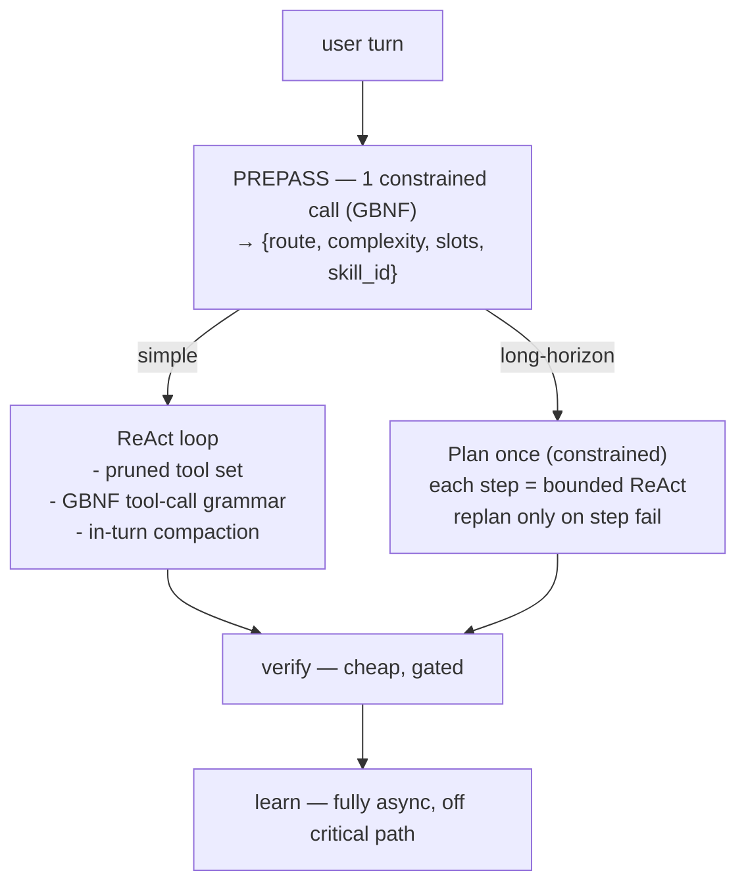

# Agentic loop redesign — small-machine first

Status: **implemented** (v1.13.0)
Owner: ha_agent
Related: [`PLAN.md` Phase 8](../PLAN.md), `agent.py`, `loop_policy.py`, `router.py`, `llm_client.py`

## Why

The current loop is a **pre-loop classifier pipeline → ReAct loop → post-loop verify/learn**
design that assumes LLM calls are cheap. On a single home machine they are not:
**one model is loaded, calls run strictly serially at ~10–40 tok/s, and prefill dominates.**

A typical tool turn issues 4–8 sequential LLM calls; an orchestrated turn 15–25+:

| # | Call | Backend role | File |
|---|------|--------------|------|
| 1 | Route classifier | router | `router.py` |
| 2 | Complexity triage (if heuristic flags) | planner | `orchestrator.py` |
| 3 | Skill selection | router | `skills/selection.py` |
| 4 | Slot binding | router | `skills/params.py` |
| 5 | Playbook selection (if custom) | classifier | `playbooks.py` |
| 6..N | Loop iterations (1 per tool round-trip + final) | worker | `agent.py` |
| N+1 | Verifier | verifier | `verifier.py` |
| N+2 | Observer (learning) | observer | `skills/observer.py` |

Two structural costs make this worse on small hardware:

- **Full tool schema re-sent every loop iteration** (`llm_client.py` `_payload`, `tool_choice: "auto"`, no pruning).
- **No structured-output constraint anywhere** — every classifier asks a small model for
  free-form JSON and fails open on parse errors.

## Guiding principles (2026 best practice)

1. Do the simplest thing that works; add LLM machinery only when it demonstrably helps. (Anthropic)
2. Hybrid ReAct/plan, but switch on a **step ceiling**, not many upfront classifier calls.
3. Context engineering = fewest high-signal tokens; **select** tools, don't dump them
   (RAG-MCP: tool-selection 14%→43%, ~½ tokens).
4. **GBNF / json_schema constrained decoding** on llama.cpp → ~100% valid structured output
   for ~5–8% decode overhead; removes the malformed-JSON failure class.
5. Compaction for long turns; sub-agents return distilled summaries, not raw context.

## Target architecture



Shifts vs today:

- Merge route + complexity + slot-binding + skill-pick into **one constrained prepass** call.
- ReAct loop sends **only a pruned tool set** (skill tools ∪ top-k retrieved ∪ 3 discovery tools).
- **All** structured outputs use grammars (no parse-failure retries).
- Verifier/observer/evaluator/repair never block the user-visible answer.
- **In-turn compaction** keeps prefill bounded as the loop runs.

---

## Phase 8 — Agentic loop modernization

Each sub-phase is independently shippable and measurable. **Measure on the target machine
after every sub-phase** (per-call latency + token counts in the trace) — the latency graph
and token bill are the arbiter.

### 8a — Structured output everywhere (P0)

**Goal:** eliminate malformed-JSON failures from small models.

- [ ] Add optional `grammar` / `response_format: {type: json_schema}` to `LlmClient._payload` (`llm_client.py`).
- [ ] Define schemas for: route, complexity, slot bindings, skill selection, verifier, observer.
- [ ] Route every classifier call through the constrained path; keep fail-open as a last resort.
- [ ] Add a config/feature flag `structured_output_enabled` (default on) for backends that lack grammar support.

**Exit criteria**
- [ ] Classifier JSON parse-failure rate ≈ 0 in traces over a test session.
- [ ] No behavioral regression in `test_router.py`, `test_loop_policy.py`, skills tests.

### 8b — Merged prepass (P0)

**Goal:** collapse 2–4 pre-loop calls into one.

- [ ] New `prepass.py`: single constrained call returning `{route, complexity, candidate_skill_id, slot_bindings}` from user text + history + compact FTS skill candidates + keyword hints.
- [ ] Keep keyword/heuristic fast-paths (`is_chitchat`, obvious news/email/action) to skip the call entirely.
- [ ] `run_agent` reads prepass result; existing `select_route_with_llm` / complexity triage / slot-binding / skill-select become fallbacks.

**Exit criteria**
- [ ] Typical tool turn drops from ~6 LLM calls to ~2–3 (trace-verified).
- [ ] Route/skill/slot accuracy ≥ current on a fixed eval set (`eval/runner.py`).

### 8c — Tool-set pruning (P0)

**Goal:** shrink the per-iteration prefill (the recurring cost).

- [ ] Build the loop `tools` array from: skill `tool_steps` tools ∪ top-k FTS/`searchToolsForDomain` ∪ `{searchTool, searchToolsForDomain, callTool}`.
- [ ] Fall back to full catalog only after explicit model discovery.
- [ ] Cap top-k via config (`max_loop_tools`, default ~8).

**Exit criteria**
- [ ] Median prompt tokens per loop iteration cut ≥ 40% on a tool-using session.
- [ ] Tool-selection success unchanged on eval set.

### 8d — In-turn compaction (P1)

**Goal:** bounded prefill as the loop progresses; protect small context windows.

- [ ] Token-budget check before each iteration in `agent.py` loop.
- [ ] When exceeded, replace older `tool` messages with a one-line distilled summary; keep last 1–2 raw results.
- [ ] Budget configurable (`turn_token_budget`).

**Exit criteria**
- [ ] Long multi-tool turns no longer grow context unbounded (trace shows flat/declining prefill).
- [ ] No drop in answer quality on long-turn eval cases.

### 8e — Answer-before-learning (P1)

**Goal:** remove post-turn model calls from perceived latency.

- [ ] Ensure `_post_turn_skills` (observer/evaluator/repair, incl. override-learning) is fully detached via `hass.async_create_task`.
- [ ] User-visible final answer emitted before any learning call starts.

**Exit criteria**
- [ ] Time-to-final-token unaffected by observer/evaluator presence (trace-verified).

### 8f — Single-backend collapse for one-machine setups (P1)

**Goal:** avoid accidental model-swap stalls; clarify the perf model.

- [ ] Detect when all roles share base_url+model; skip redundant role indirection.
- [ ] Document role-splitting as multi-GPU / multi-host only (`docs/`, options flow help text).

**Exit criteria**
- [ ] No redundant role calls when roles are identical (trace-verified).

### 8g — Replan trigger for orchestrated path (P2)

- [ ] On worker step failure, return to planner for a revised remainder with `max_replans` budget.
- [ ] Pre-plan retained for happy path; replanning is the escape hatch.

**Exit criteria**
- [ ] Orchestrated turns recover from a mid-plan tool failure without full restart (test).

### 8h — Parallel independent tool calls (P2)

- [ ] When the model emits multiple independent calls (or a plan step lists parallelizable tools), `asyncio.gather` them in `_process_tool_calls`.
- [ ] Preserve ordering/stuck-detection semantics for dependent calls.

**Exit criteria**
- [ ] Multi-call steps complete in ~max(call) instead of sum(call) wall time.

### 8i — Consolidated local telemetry (P2)

- [ ] Extend traces with per-call latency + prompt/completion token counts to SQLite.
- [ ] Surface a per-turn breakdown (calls, tokens, ms) in the console activity tab.

**Exit criteria**
- [ ] Each turn shows where time/tokens went; enables data-driven tuning of 8a–8h.

### 8j — KV-cache & deployment hygiene (P3)

- [x] Keep stable prefix (system prompt, tool schema, MCP session prompt) unchanged mid-turn so llama.cpp prompt cache hits across iterations; volatile guidance stays at the end.
- [x] Deployment docs: Q4_K_M weights, `--flash-attn`, right-sized `--ctx-size`, avoid KV quant `q4_0` (degrades tool calling).

**Exit criteria**
- [ ] Prompt-cache hit across iterations observable in llama.cpp logs.
- [ ] Deployment guidance documented.

---

## Sequencing

```
8a ──► 8b ──► 8c        (P0: do first; biggest latency + reliability wins)
        └► 8e
8d ──► 8f               (P1)
8g ──► 8h ──► 8i        (P2)
8j                      (P3, ongoing)
```

8a unblocks everything: reliable structured output makes the merged prepass (8b) safe.
8i (telemetry) can be pulled earlier if we want hard numbers before/after each change.

## Risks / non-goals

- **Backend grammar support varies.** 8a must degrade gracefully (flag + fail-open fallback).
- **Not** removing skills/learning — moving it off the hot path (8e) and constraining it (8a).
- **Not** adopting a heavy framework (LangGraph etc.); keep simple composable functions.
- Multi-host/multi-GPU role splitting stays supported; 8f only optimizes the single-machine case.

## Deployment hygiene (single-machine llama.cpp)

- Use **Q4_K_M** (or similar) weights sized to fit RAM/VRAM with headroom for context.
- Enable **`--flash-attn`** when your build supports it.
- Set **`--ctx-size`** to the smallest value that fits your longest turn (system + pruned tools + history); oversized ctx wastes memory.
- Avoid KV quant **`q4_0`** for tool-calling workloads — it often degrades structured output reliability.
- Keep the **system prompt and tool schema stable** within a turn; loop guidance is injected at the end of the message list so llama.cpp prompt-cache hits across iterations.

---

## Definition of done (Phase 8)

- [ ] Typical tool turn ≤ 3 LLM calls; per-iteration prompt tokens down ≥ 40%.
- [ ] Classifier parse-failure rate ≈ 0.
- [ ] Time-to-final-token improved measurably on the target machine vs current `main`.
- [ ] All ruff CI checks pass; eval set accuracy ≥ pre-redesign baseline.
