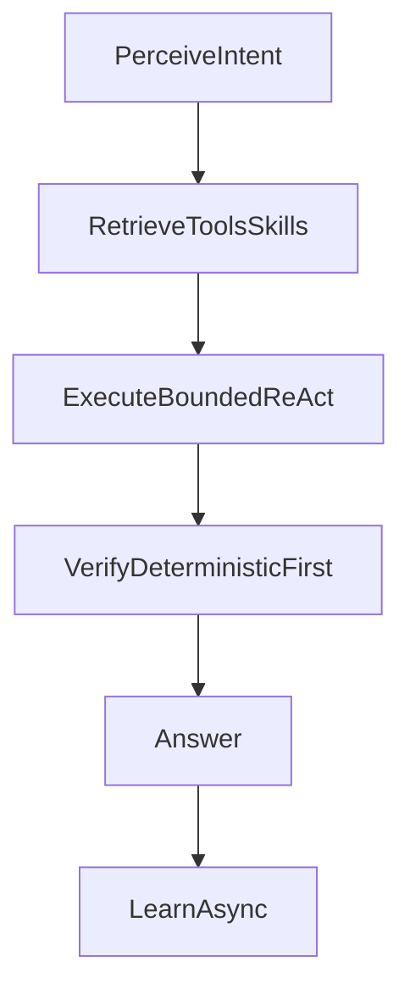

# Architecture redesign — implementable plan

Source: `PLAN.md` Phase 11. Companion design rationale:
[docs/agentic-loop-redesign.md](agentic-loop-redesign.md).

## 0. Goal and non-goals

Goal: rework agent internals across 5 tracks while keeping every external
contract stable: Assist streaming, config entry v11 keys, skills on disk +
markdown frontmatter, MCP proxy protocol, multi-backend role configs,
console WebSocket APIs.

Non-goals: no new user-facing features, no framework adoption (LangGraph
etc.), no config migration unless adding optional keys (then v11 to v12 with
defaults), no model or host changes.

## 1. Current architecture (what you inherit)

Turn flow: `conversation.py` (`HaAgentConversationEntity`) streams deltas from
`run_agent()` in `custom_components/ha_agent/agent.py` (~2.9k lines).

Pre-turn classifiers: `prepass.py` (merged route + complexity + skill + slots),
`router.py` (`TaskRoute.HA_ACTION` vs `TaskRoute.CHAT`, `align_route_to_skill`),
`orchestrator.py` (`Complexity`, `plan_subtasks`, `replan_after_failure`).

Loop guardrails: `custom_components/ha_agent/loop_policy.py` (~4.1k lines,
`LoopState` with ~30 mutable fields, plus `should_retry_*`, `build_*_nudge`,
`claims_*`, `honest_*`, `reconcile_plan_*`, `record_*` helpers — see the import
block at the top of `agent.py` for the full inventory to migrate).

Tools: `tools.py` (normalization, e.g. `light.turn_on` split, display-name to
`entity_id`), `mcp_client.py` / `mcp_session.py` (`searchToolsForDomain` /
`searchTool` / `callTool`), `tool_pruning.py` (`prune_loop_tools`),
`context.py` (regex intent helpers), `subagent.py` (`run_worker`).

Retrieval: `skills/selection.py` (~989 lines: FTS + Jaccard + marker tables
`_ROUTE_DOMAIN_MARKERS`, `_ROUTE_TOOL_MARKERS`, `_SOFT_DOMAIN_HINTS`),
`skills/discovery.py`, `skills/params.py`, `skills/models.py` (`Skill`,
`SkillSlot`, `TurnTrace`).

Roles: `role_registry.py` (`ModelRole`: router, planner, verifier, observer,
worker_chat, worker_action) fed by `config_helpers.py` backends; critic in
`verifier.py`; learning in `skills/observer.py`, `skills/evaluator.py`,
`skills/learning_policy.py`, `skills/repair.py`; schemas in
`structured_output.py`.



## 2. Implementer quickstart (run these first)

```bash
ruff check custom_components tests
python -m pytest tests/ -q --tb=short
python -m pytest tests/skills/test_selection_corpus.py tests/skills/test_selection.py tests/test_context.py -q
```

Key suites per area: `tests/test_agent.py`, `tests/test_loop_policy.py`,
`tests/test_loop_memory_improvements.py`, `tests/test_tools.py`,
`tests/test_router.py`, `tests/test_prepass.py`,
`tests/skills/test_selection_corpus.py` (+ `tests/fixtures/skill_selection/`),
`tests/test_websocket_api.py`, `tests/test_chat_api.py`.

Eval harness: `custom_components/ha_agent/eval/runner.py` plus
`eval/cases.py`. Capture a baseline (pass rate, median tool turns, LLM calls
per turn) before Phase 1 and require parity after every phase.

## 3. Shared conventions for all phases

- Every phase lands behind a flag defaulting to off, following the existing
  `CONF_STRUCTURED_OUTPUT_ENABLED` / `CONF_PREPAS_ENABLED` pattern in
  `const.py` + `config_helpers.py` (`AgentConfig`): proposed flags
  `pipeline_v2`, `direct_ha_tools`, `unified_retrieval`. Old path stays green
  until the flag flips.
- No signature changes to `run_agent()` callers (`conversation.py`,
  console chat API, diagnostics inject) without updating all three plus tests.
- Streaming contract is sacred: `AgentDelta` content/thinking/tool events keep
  flowing to Assist TTS; learning/verification never blocks the final answer
  (existing 8e direction).
- Each phase ends with: `ruff check`, full `pytest`, corpus suite, eval parity
  (accuracy >= baseline, tool-turn LLM calls not regressed), and a short note
  in `docs/agentic-loop-redesign.md` exit criteria.

## 4. Target interfaces (define these in Phase 1, reuse after)

```python
@dataclass(frozen=True, slots=True)
class TurnContext:
    user_text: str
    history: list[dict[str, str]]
    route: str            # "chat" | "action"
    intent: Intent        # parsed once in perceive.py
    exposed_entities: list[dict]
    conversation_id: str | None

@dataclass(slots=True)
class Observation:
    tool_name: str
    arguments: dict
    succeeded: bool
    output: str           # truncated as today
    entity_id: str | None

@dataclass(slots=True)
class ExecutionTrace:
    context: TurnContext
    observations: list[Observation] = field(default_factory=list)
    decisions: list[str] = field(default_factory=list)  # audit trail

class Decision(StrEnum):
    ANSWER = "answer"
    RETRY_STATE_CHECK = "retry_state_check"
    RETRY_SAME_SERVICE = "retry_same_service"
    CONTINUE_TOOLS = "continue_tools"
    ABORT_HONEST = "abort_honest"
```

Policy rule: stages are pure functions over `TurnContext` + `ExecutionTrace`
returning `Decision` plus an optional internal nudge string. No stage mutates
another stage's inputs. `LoopState` fields map 1:1 into `TurnContext`
(frozen) or `ExecutionTrace` (append-only) — do the mapping explicitly in a
`turn/compat.py` shim during Phase 1 so old and new paths share helpers.

## 5. Phases

### Phase 0 — baseline and gates (0.5 day)

Objective: measurable floor before refactoring.
Files: `eval/runner.py`, `eval/cases.py`, `skills/models.py` (`TurnTrace`),
`tests/skills/test_selection_corpus.py`.
Steps: run quickstart suite, record baseline numbers; add per-turn
latency/token breakdown to `TurnTrace` if missing; pin corpus fixtures as
regression gates.
Exit: baseline recorded; `ruff` + `pytest` green on `main`.

### Phase 1 — pipeline split, no behavior change (2–3 days)

Objective: same decisions, smaller modules.
New package `custom_components/ha_agent/turn/`:
`pipeline.py` (thin orchestrator called by `run_agent()`),
`perceive.py` (route/intent via prepass+router+heuristics),
`retrieve.py` (skills/tools pruning),
`execute.py` (bounded ReAct + `run_worker` reuse),
`verify.py` (answer gating), `compat.py` (LoopState shim).
Steps: move helpers verbatim first (imports in `agent.py` are the checklist),
then convert `should_retry_*` / `build_*_nudge` to `Trace -> Decision`
pure functions with unit tests in `tests/test_turn_pipeline.py` (new).
Exit: old path and `pipeline_v2` path produce identical traces on eval set;
`subagent.py` uses `execute.py`.

### Phase 2 — role collapse + deterministic verifier (1–2 days)

Objective: 2 effective backends, critic off hot path.
Files: `role_registry.py`, `config_helpers.py`, `verifier.py`,
`skills/observer.py`, `skills/evaluator.py`, `llm_telemetry.py`.
Steps: add `RoleRegistry.collapsed_backends()` — when all roles share
base_url+model, skip indirection (design 8f); keep every config key working
and `backend_for()` semantics unchanged for split setups. Reorder
verification: deterministic checks first (control tool succeeded?
`ha_get_state` matches requested on/off? success claimed with no tool?
failure claimed with confirmed state?), LLM `verify_turn()` only on
ambiguity or `skill_followed` disputes. Detach observer/evaluator/repair via
`hass.async_create_task` after the answer is emitted.
Exit: single-model setups show fewer backend hops in traces; tool-turn LLM
calls <= 3 typical; no latency regression with learning enabled.

### Phase 3 — unified retrieval (2–3 days)

Objective: one index, intent parsed once.
Files: `context.py`, `skills/selection.py`, `skills/discovery.py`,
`skills/params.py`, `tool_pruning.py`, new `turn/retrieve.py` backend.
Steps: keep `context.py` regexes as fast-paths only (chitchat, explicit
`entity_id`); build a single ranked index over skill triggers/titles/bodies
+ tool descriptions + area/friendly names behind `unified_retrieval`;
`perceive.py` resolves `query` / `entity_id` / `service` once and passes them
to skill params (stop re-inferring per stage); `is_status_then_act_query` /
`includes_device_command_clause` become derived intent properties.
Exit: corpus suite (`tests/fixtures/skill_selection/`, incl. the
check-and-act compound case) passes; no per-domain special cases added
(workspace rule: mechanism over domain lists).

### Phase 4 — direct HA hot path (2 days)

Objective: cut MCP round trips for entity control/lookup.
New `custom_components/ha_agent/ha_tools.py` calling HA registries/services
in-process for `ha_search` / `ha_get_state` / `ha_call_service` /
`ha_bulk_control` equivalents. Files: `tools.py` (shared normalization),
`mcp_client.py`, `mcp_session.py`, `tool_pruning.py`.
Steps: share `tools.py` normalization on both paths (service split,
display-name resolution); prune set becomes plan tools + direct HA tools +
`callTool` escape hatch; MCP stays for mail/news/external; fall back to MCP
when direct reports unknown/unavailable entity. Gate with `direct_ha_tools`.
Exit: light on/off + cover + lock scenarios pass on both paths; 400-class
validation errors from combined `service: light.turn_on` shapes are covered
by a unit test (see `tests/test_tools.py` service-split test).

### Phase 5 — skills simplification (2 days)

Objective: fewer passes, explicit lifecycle.
Files: `skills/observer.py`, `skills/evaluator.py`,
`skills/learning_policy.py`, `skills/repair.py`, `skills/generalize.py`,
`skills/store.py`, `skills/files.py`, `skills/bundled.py`.
Steps: merge `observe_skill_candidate` / `observe_skill_fork` /
`observe_skill_override` / `evaluate_skill_use` / `auto_repair_skill` into
`propose -> evaluate -> promote` with diff/preview and versioning in the
store; `Skill` dataclass + markdown frontmatter unchanged; per-skill
`llm_model`/`llm_base_url` still honored, default inherited worker.
Exit: existing skills load unchanged; auto-save default stays off; new
lifecycle covered by `tests/skills/` additions.

### Phase 6 — rollout (0.5–1 day)

Objective: safe enablement.
Steps: flags default off; flip per phase only on eval parity; additive
migration only (new optional keys get v11->v12 defaults if needed);
update `docs/agentic-loop-redesign.md` exit criteria + single-model
deployment notes; console activity surfaces which path served the turn
(flag + collapsed backend) for debugging.
Exit: all flags documented; `ruff` + full `pytest` + eval parity green.

## 6. Risk register

- LoopState shim drift during Phase 1: mitigate with trace-equality check on
  eval set before deleting old code.
- Retrieval regressions on paraphrases: corpus suite is the gate; add failing
  phrases as fixtures before changing ranking.
- Direct-HA vs MCP divergence: shared normalization + dual-path scenario tests.
- Streaming breakage: never await learning/verifier before emitting the final
  delta; covered by `tests/test_chat_api.py` streaming tests.
- Scope creep into skills format changes: forbidden by compat contract;
  format changes need their own proposal.
