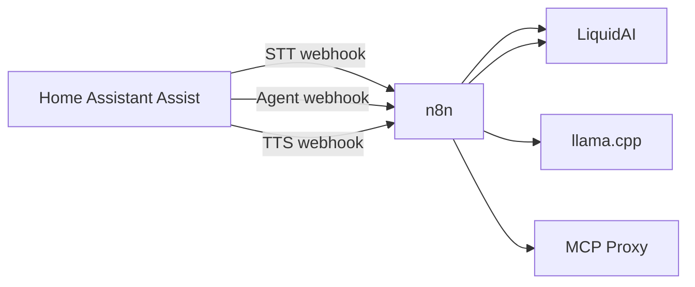
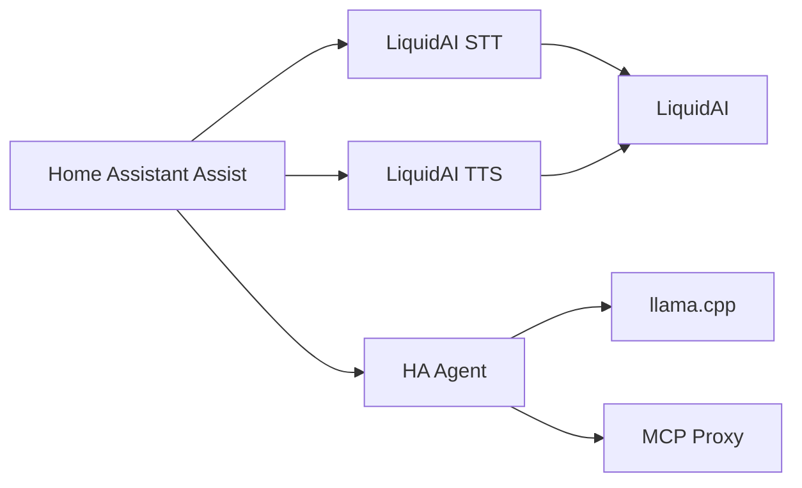

# Migration from n8n Webhook Conversation

This guide replaces the **conversation agent** branch of the [ha_liquidai_n8n](https://github.com/holger81/ha_liquidai_n8n) hybrid workflow with native **[HA Agent](https://github.com/holger81/ha_agent)**. For STT and TTS, use **[ha_liquidai](https://github.com/holger81/ha_liquidai)** (see links at the end).

After migration you no longer need n8n or **Webhook Conversation** for daily Assist use.

## Before (n8n hybrid)



| HA pipeline stage | Old provider |
|-------------------|--------------|
| Speech-to-text | Webhook STT → n8n → LiquidAI ASR |
| Conversation | Webhook Conversation → n8n Agent |
| Text-to-speech | Webhook TTS → n8n → LiquidAI TTS |

## After (native integrations)



| HA pipeline stage | New provider |
|-------------------|--------------|
| Speech-to-text | **LiquidAI STT** (`stt.ha_liquidai_custom`) |
| Conversation | **HA Agent** (`conversation.ha_agent`) |
| Text-to-speech | **LiquidAI TTS** (`tts.ha_liquidai_custom`) |

---

## Prerequisites

- Home Assistant **2025.10+**
- OpenAI-compatible LLM (same llama.cpp URL you used in n8n)
- MCP Proxy with bearer token (same as n8n **MCP Proxy** node)
- [HACS](https://hacs.xyz/) (recommended)

---

## Step 1 — Install native integrations

### HA Agent (conversation)

1. HACS → **Integrations** → **⋮** → **Custom repositories**
2. Add `https://github.com/holger81/ha_agent` (category **Integration**)
3. Search **HA Agent** → **Download** → restart Home Assistant
4. **Settings → Devices & services → Add integration → HA Agent**
5. Complete the wizard:
   - **LLM base URL** — same as n8n OpenAI credential (e.g. `http://192.168.10.31:9292/v1`)
   - **MCP URL** — same as n8n MCP node (e.g. `http://192.168.10.31:2222/mcp`)
   - **Bearer token** — same MCP API client token from n8n

### LiquidAI (STT + TTS)

If you still use n8n for speech:

1. Add HACS repo `https://github.com/holger81/ha_liquidai`
2. Install **LiquidAI**, restart, add integration
3. Set LiquidAI base URL (e.g. `http://192.168.10.31:8811`)

See [ha_liquidai assist-setup](https://github.com/holger81/ha_liquidai/blob/main/docs/assist-setup.md).

---

## Step 2 — Switch the Assist pipeline

1. **Settings → Voice assistants** → open your assistant → **Configure**
2. Set:

   | Stage | Provider |
   |-------|----------|
   | Speech-to-text | **LiquidAI STT** |
   | Conversation | **HA Agent** |
   | Text-to-speech | **LiquidAI TTS** |

3. **Save**

4. **Settings → Voice assistants → Expose** — ensure devices you want to control are exposed (same as before).

---

## Step 3 — Validate before turning off n8n

Run from your dev machine (optional):

```bash
pip install aiohttp
export HA_AGENT_MCP_TOKEN="your-mcp-bearer-token"   # if required
python3 scripts/smoke_test_phase4.py
```

In Assist, test:

- [ ] **Device command** — *“Turn off the dining room lights”* (exposed entity)
- [ ] **Search + action** — *“Open the patio cover”* (MCP search if not exposed)
- [ ] **News** — *“What’s the news?”*
- [ ] **Follow-up** — turn lights on, then *“Turn them back off”* (conversation memory)
- [ ] **Voice** — reply streams to TTS (check pipeline debug for `stream_response: true`)

Compare latency and tool behaviour with the old n8n agent. MCP token and LLM model should match what worked in n8n.

---

## Step 4 — Remove n8n from Assist

When validation passes:

### Home Assistant

1. **Settings → Devices & services**
2. Remove **Webhook Conversation** integration (or leave installed but **unwire** all three sub-entries from the pipeline)
3. Confirm the pipeline uses only LiquidAI STT, HA Agent, and LiquidAI TTS

### n8n (optional shutdown)

In [ha_liquidai_n8n](https://github.com/holger81/ha_liquidai_n8n):

1. **Deactivate** workflow **Webhook Conversation (Hybrid)**
2. Stop the n8n container if nothing else uses it

The workflow JSON remains in that repo as a **legacy reference** only.

---

## Behaviour mapping (n8n → HA Agent)

| n8n | HA Agent |
|-----|----------|
| LangChain Agent node | `run_agent()` tool loop |
| MCP Client Tool sub-node | `McpProxyClient` + `callTool` |
| Memory Buffer Window | `memory.py` per `conversation_id` |
| OpenAI Chat Model sub-node | `llm_client.py` (OpenAI-compatible) |
| Agent input Code node | `context.py` + exposed entities |
| Streaming webhook response | Native `conversation.py` streaming |
| `maxIterations: 15` | **Max tool iterations** in config (default 8; raise in UI if needed) |
| Hard-coded URLs in workflow | Config flow + device page selects |

### New capabilities (not in n8n)

- **Action model routing** — optional smaller LLM for device commands
- **Learned skills** — multi-step workflows saved and reused (device switches on HA Agent device page)
- **Diagnostic sensors** — last route, MCP tool count, LLM/MCP health
- **No n8n hop** — lower latency, fewer moving parts

---

## Configuration cheat sheet

| n8n setting | HA Agent setting |
|-------------|------------------|
| OpenAI credential base URL | **LLM base URL** |
| OpenAI model name | **Chat model** (device select or config flow) |
| MCP endpoint URL | **MCP URL** |
| Bearer Auth token | **MCP bearer token** |
| Agent system prompt | **Agent system prompt** |
| `maxIterations` | **Max agent iterations** |
| Streaming webhook | **Enable streaming responses** |

---

## Rollback

1. Re-enable the n8n workflow and **Webhook Conversation** sub-entries.
2. Point the Assist pipeline back to Webhook STT / Conversation / TTS.
3. Remove or disable the HA Agent conversation entry from the pipeline.

Your HA Agent config entry is preserved if you want to switch back later.

---

## Related docs

- [Assist pipeline setup](./assist-setup.md) — full HA Agent configuration
- [ha_liquidai: migration from n8n STT](https://github.com/holger81/ha_liquidai/blob/main/docs/migration-from-n8n-stt.md)
- [ha_liquidai: migration from n8n TTS](https://github.com/holger81/ha_liquidai/blob/main/docs/migration-from-n8n-tts.md)
- [Legacy n8n workflow reference](./legacy/n8n-hybrid-workflow.md)
